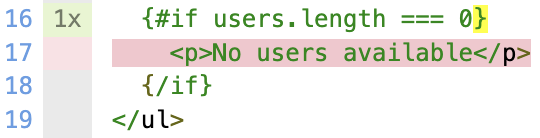
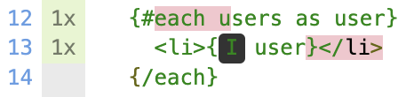

[Examples - Working sourcemaps](#working-sourcemaps) | [Examples - Broken sourcemaps](#broken-sourcemaps)

Reproduction / debugging setup for [sveltejs/svelte#7824](https://github.com/sveltejs/svelte/issues/7824).

```bash
git clone https://github.com/AriPerkkio/svelte-istanbul-reproduction.git
cd svelte-istanbul-reproduction
pnpm i
pnpm start
npx live-server@1.2.1 ./coverage
```

Remove following from `package.json` if local Svelte compiler is not present:

```diff
-  "pnpm": {
-    "overrides": {
-      "svelte": "link:../svelte"
-    }
-  }
```

## Examples

### Working sourcemaps



Line 16 described below.

#### Decoded mappings of transpiled.js.map

```js
75 | [[26, 0, 15, 7], [29, 0, 15, 12], [33, 0, 15, 13], [39, 0, 15, 19], [44, 0, 15, 24], [45, 0, 15, 25]]
```

Mapping pairs:

- #1 `[26, 0, 15, 7], [29, 0, 15, 12]`
- #2 `[33, 0, 15, 13], [39, 0, 15, 19]`
- #3 `[44, 0, 15, 24], [45, 0, 15, 25]`

#### transpiled.js

```js
75                | let if_block = /*users*/ ctx[0].length === 0 && create_if_block(ctx);
Mapping pair #1   |                          ^^^    |    |     |
Mapping pair #2   |                                 ^^^^^^     |
Mapping pair #3   |                                            ^
```

#### Map to repro.svelte

```js
16                |  {#if users.length === 0}
Mapping pair #1   |       ^^^^^ |    |     |
Mapping pair #2   |             ^^^^^^     |
Mapping pair #3   |                        ^
```

#### Decoded mappings of instrumented.js.map

```js
1963 |  [[54, 0, 15, 7], [86, 0, 15, 12], [90, 0, 15, 13, 3], [96, 0, 15, 19], [101, 0, 15, 24], [102, 0, 15, 25]]
1964 |  [[2, 0, 15, 25]]
```

Mapping pairs:

- #1 `[54, 0, 15, 7], [86, 0, 15, 12]`
- #2 `[90, 0, 15, 13, 3], [96, 0, 15, 19]`
- #3 `[101, 0, 15, 24], [102, 0, 15, 25]`
- #4 `[2, 0, 15, 25]`

#### instrumented.js

```js
1963                |  let if_block = ( /*users*/cov_208gup579f().s[24]++, (cov_208gup579f().b[4][0]++, ctx[0].length === 0) && (cov_208gup579f().b[4][1]++, create_if_block(ctx)));
Mapping pair #1     |                                                      ^^^^^^^^^^^^^^^^^^^^^^^^^^^^^^^^    |    |     |
Mapping pair #2     |                                                                                          ^^^^^^     |
Mapping pair #3     |                                                                                                     ^
1964                |  cov_208gup579f().s[25]++;
Mapping pair #4     |  ^
```

#### Map to repro.svelte

```js
16                  |  {#if users.length === 0}
Mapping pair #1     |       ^^^^^ |    |     |
Mapping pair #2     |             ^^^^^^     |
Mapping pair #3     |                        ^
Mapping pair #4     |                        ^
```

#### Coverage map before remapping

```json
"branchMap": {
  "4": {
    "type": "binary-expr",
    "loc": {
      "start": { "line": 75, "column": 26 },
      "end": { "line": 75, "column": 69 }
    },
    "locations": [
      {
        "start": { "line": 75, "column": 26 },
        "end": { "line": 75, "column": 45 }
      },
      {
        "start": { "line": 75, "column": 49 },
        "end": { "line": 75, "column": 69 }
      }
    ],
    "line": 75
  }
}
```

```js
75                          | let if_block = /*users*/ ctx[0].length === 0 && create_if_block(ctx);
branchMap["4"].locations[1] |                          ^^^^^^^^^^^^^^^^^^^    |                   |
branchMap["4"].locations[2] |                                                 ^^^^^^^^^^^^^^^^^^^^^
```

#### Coverage map after remapping

```json
"branchMap": {
  "2": {
    "type": "binary-expr",
    "loc": {
      "start": { "line": 16, "column": 7 },
      "end": { "line": 16, "column": null }
    },
    "locations": [
      {
      "start": { "line": 16, "column": 7 },
      "end": { "line": 16, "column": 25 }
      },
      {
      "start": { "line": 16, "column": 25 },
      "end": { "line": 16, "column": null }
      }
    ]
  }
}
```

```js
16           |  {#if users.length === 0}
locations[1] |       ^^^^^^^^^^^^^^^^^^
locations[2] |                        ^// Implicit else
```

### Broken sourcemaps



Line 13 described below.

#### Decoded mappings of transpiled.js.map

```js
26 | [[24, 0, 12, 9], [27, 0, 12, 13]]
35 | [[3, 0, 12, 4], [9, 0, 12, 19]]
39 | [[62, 0, 12, 9], [65, 0, 12, 13]]
```

Mapping pairs:

- #1 `[24, 0, 12, 9], [27, 0, 12, 13]`
- #2 `[3, 0, 12, 4], [9, 0, 12, 19]`
- #3 `[62, 0, 12, 9], [65, 0, 12, 13]`

#### transpiled.js

```js
26                |  let t_value = /*user*/ ctx[1] + "";
Mapping pair #1   |                         ^^^
35                |   insert(target, li, anchor);
Mapping pair #2   |   ^^^^^^
39                |   if (dirty & /*users*/ 1 && t_value !== (t_value = /*user*/ ctx[1] + "")) set_data(t, t_value);
Mapping pair #3   |                                                              ^^^
```

#### Map to repro.svelte

```js
13                |    <li>{user}</li>
Mapping pair #1   |    |    ^^^^     |
Mapping pair #2   |    ^^^^^^^^^^^^^^^
Mapping pair #3   |         ^^^^
```

#### Decoded mappings of instrumented.js.map

```js
1878 | [[51, 0, 12, 9, 0],[54, 0, 12, 13]]
1892 | [[6, 0, 12, 4, 1],[12, 0, 12, 19]]
1893 | [[6, 0, 12, 19]]
1899 | [[122, 0, 12, 9, 0],[125, 0, 12, 13]]
1900 | [[8, 0, 12, 13]]
1901 | [[8, 0, 12, 13]]
1902 | [[8, 0, 12, 13, 2]]
1903 | [[6, 0, 12, 13]]
1904 | [[8, 0, 12, 13]]
1905 | [[6, 0, 12, 13]]
```

Mapping pairs:

- #1 `[51, 0, 12, 9, 0],[54, 0, 12, 13]`
- #2 `[6, 0, 12, 4, 1],[12, 0, 12, 19]`
- #3 `[6, 0, 12, 19]`
- #4 `[122, 0, 12, 9, 0],[125, 0, 12, 13]`
- #5 `[8, 0, 12, 13]`
- #6 `[8, 0, 12, 13]`
- #7 `[8, 0, 12, 13, 2]`
- #8 `[6, 0, 12, 13]`
- #9 `[8, 0, 12, 13]`
- #10 `[6, 0, 12, 13]`

#### instrumented.js

```js
1878                |  let t_value = ( /*user*/cov_208gup579f().s[3]++, ctx[1] + "");
Mapping pair #1     |                                                   ^^^
1892                |      insert(target, li, anchor);
Mapping pair #2     |      ^^^^^^
1893                |      cov_208gup579f().s[8]++;
Mapping pair #3     |      ^
1899                |      if ((cov_208gup579f().b[1][0]++, dirty & /*users*/1) && (cov_208gup579f().b[1][1]++, t_value !== (t_value = /*user*/ctx[1] + ""))) {
Mapping pair #4     |                                                                                                                          ^^^
1900                |        cov_208gup579f().b[0][0]++;
Mapping pair #5     |        ^
1901                |        cov_208gup579f().s[10]++;
Mapping pair #6     |        ^
1902                |        set_data(t, t_value);
Mapping pair #7     |        ^
1903                |      } else {
Mapping pair #8     |      ^
1904                |        cov_208gup579f().b[0][1]++;
Mapping pair #9     |        ^
1905                |      }
Mapping pair #10    |      ^
```

#### Map to repro.svelte

```js
13                  |    <li>{user}</li>
Mapping pair #1     |    |    ^^^^     |
Mapping pair #2     |    ^^^^^^^^^^^^^^^
Mapping pair #3     |         |  |     ^
Mapping pair #4     |         ^^^^
Mapping pair #5     |            ^
Mapping pair #6     |            ^
Mapping pair #7     |            ^
Mapping pair #8     |            ^
Mapping pair #9     |            ^
Mapping pair #10    |            ^
```

#### Coverage map before remapping

```js
"statementMap": {
  "3": {
    "start": { "line": 26, "column": 24 },
    "end": { "line": 26, "column": 35 }
  },
  "7": {
    "start": { "line": 35, "column": 3 },
    "end": { "line": 35, "column": 30 }
  },
  "9": {
    "start": { "line": 39, "column": 3 },
    "end": { "line": 39, "column": 97 }
  },
  "10": {
    "start": { "line": 39, "column": 76 },
    "end": { "line": 39, "column": 97 }
  }
},
"branchMap": {
  "0": {
    "loc": {
      "start": { "line": 39, "column": 3 },
      "end": { "line": 39, "column": 97 }
    },
    "type": "if",
    "locations": [
      {
        "start": { "line": 39, "column": 3 },
        "end": { "line": 39, "column": 97 }
      },
      { "start": {}, "end": {} } // Implicit else
    ],
    "line": 39
  },
  "1": {
    "loc": {
      "start": { "line": 39, "column": 7 },
      "end": { "line": 39, "column": 74 }
    },
    "type": "binary-expr",
    "locations": [
      {
        "start": { "line": 39, "column": 7 },
        "end": { "line": 39, "column": 26 }
      },
      {
        "start": { "line": 39, "column": 30 },
        "end": { "line": 39, "column": 74 }
      }
    ],
    "line": 39
  }
}
```

```js
26                          |  let t_value = /*user*/ ctx[1] + "";
statementMap["3"]           |                         ^^^^^^^^^^^
35                          |   insert(target, li, anchor);
statementMap["7"]           |   ^^^^^^^^^^^^^^^^^^^^^^^^^^^
39                          |   if (dirty & /*users*/ 1 && t_value !== (t_value = /*user*/ ctx[1] + "")) set_data(t, t_value);
statementMap["9"]           |   ^^^^^^^^^^^^^^^^^^^^^^^^^^^^^^^^^^^^^^^^^^^^^^^^^^^^^^^^^^^^^^^^^^^^^^^^^^^^^^^^^^^^^^^^^^^^^^
statementMap["10"]          |                                                                            ^^^^^^^^^^^^^^^^^^^^^
branchMap["0"].locations[0] |   ^^^^^^^^^^^^^^^^^^^^^^^^^^^^^^^^^^^^^^^^^^^^^^^^^^^^^^^^^^^^^^^^^^^^^^^^^^^^^^^^^^^^^^^^^^^^^^
branchMap["1"].locations[0] |       ^^^^^^^^^^^^^^^^^^^                                                
branchMap["1"].locations[1] |                              ^^^^^^^^^^^^^^^^^^^^^^^^^^^^^^^^^^^^^^^^^^^^
```

#### Coverage map after remapping

```js
"statementMap": {
  "0": {
    "start": { "line": 13, "column": 9 },
    "end": { "line": 13, "column": 19 }
  },
  "1": {
    "start": { "line": 13, "column": 4 },
    "end": { "line": 13, "column": null }
  },
  "2": {
    "start": { "line": 13, "column": 13 },
    "end": { "line": 13, "column": 19 }
  },
  ...
},
"branchMap": {
  "0": {
    "loc": { "start": { "line": 13, "column": 9 }, "end": { "line": 13, "column": 19 } },
    "type": "if",
    "locations": [
      { 
        "start": { "line": 13, "column": 9 },
        "end": { "line": 13, "column": 19 }
      }
    ]
  },
  "1": {
    "loc": { "start": { "line": 13, "column": 9 }, "end": { "line": 13, "column": 19 } },
    "type": "binary-expr",
    "locations": [
      {
        "start": { "line": 13, "column": 9 },
        "end": { "line": 13, "column": 13 }
      },
      {
        "start": { "line": 13, "column": 9 },
        "end": { "line": 13, "column": 19 }
      }
    ]
  },
  ...
}
```

```js
13                          |    <li>{user}</li>
statementMap["0"]           |         ^^^^^^^^^^
statementMap["1"]           |    ^
statementMap["2"]           |             ^^^^^^
branchMap["0"].locations[0] |         ^^^^^^^^^^
branchMap["1"].locations[0] |         ^^^^
branchMap["1"].locations[1] |         ^^^^^^^^^^
```
